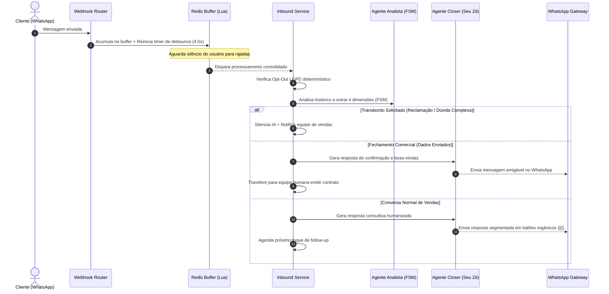
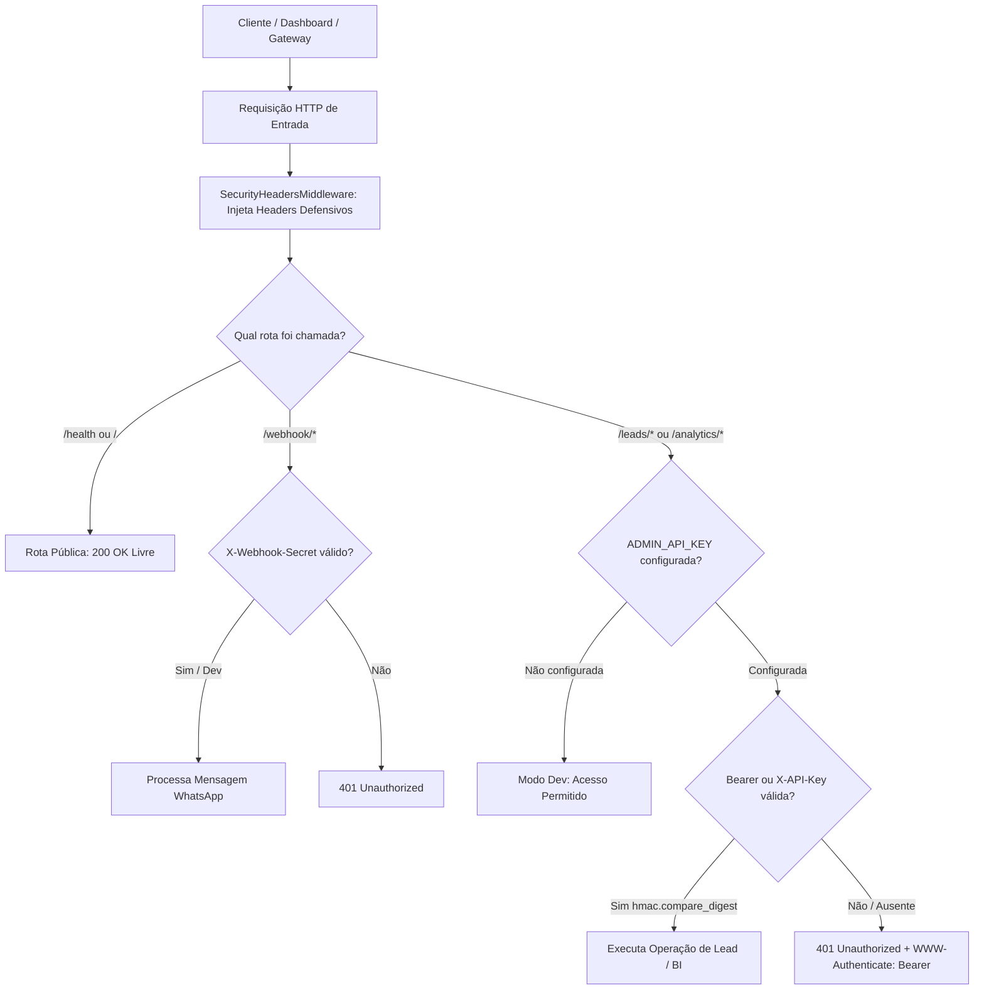

# 🏛️ Arquitetura do Sistema - Ecossistema de Vendas Inteligentte

Este documento descreve a arquitetura de software, padrões de design, estrutura de pastas e fluxos de dados do **Ecossistema de Vendas Autônomo da Inteligentte Lab**.

---

## 1. 📐 Visão Geral e Princípios Arquiteturais

O sistema é construído como um **Monólito Modular Assíncrono** com separação estrita de camadas e foco em alta concorrência para WhatsApp:

* **Clean Architecture & DIP (Dependency Inversion Principle):** Rotas HTTP não acessam o banco de dados diretamente nem chamam APIs externas. A cadeia de dependência segue: `API Routers -> Services -> Repositories -> Database/Cache`.
* **FSM Multidimensional:** Máquina de estados desacoplada em 4 dimensões (`EtapaFunil`, `DesfechoLead`, `ControleAtendimento`, `TemperaturaLead`), eliminando perdas de contexto em transbordo.
* **FinOps & Anti-Looping:** Semáforos de concorrência (`asyncio.Semaphore`), roteamento dinâmico de modelos (`gpt-4o-mini` vs `gpt-4o`) e `ConversationPacingService` com encerramento Zero-Touch para leads estagnados.
* **Debounce Atômico de Rajadas:** Script Lua no Redis para consolidar múltiplas mensagens consecutivas do WhatsApp antes de acionar a inteligência artificial.

---

## 2. 🗂️ Estrutura de Diretórios Padronizada

```text
backend/
├── agents/                     # Agentes Cognitivos de IA
│   ├── prompts/                # Personas e diretrizes modulares
│   │   ├── closer_vendedor.py  # Prompt e tom de voz do consultor Seu Zé
│   │   ├── analista.py         # Prompt analítico FSM e supervisor
│   │   ├── followup.py         # Diretrizes dos toques de cadência
│   │   ├── auditor.py          # Prompt do dossiê comercial post-mortem
│   │   └── __init__.py         # Re-exportação centralizada
│   ├── lead_analyzer_agent.py  # Analista FSM (JSON estrito Pydantic)
│   ├── sales_closer_agent.py   # Closer consultivo frontline
│   └── deal_auditor_agent.py   # Auditor comercial executivo
│
├── api/                        # Camada de Apresentação (FastAPI)
│   └── routers/
│       ├── webhook.py          # Ingestão de webhooks Uazapi/WhatsApp
│       ├── leads.py            # API REST de consulta, transbordo e auditoria
│       └── analytics.py        # Endpoints de Business Intelligence e Dashboard
│
├── core/                       # Núcleo Transversal e Infraestrutura
│   ├── __init__.py             # Fachada central (re-exportação limpa)
│   ├── config.py               # Settings validadas com Pydantic
│   ├── security.py             # Autenticação em tempo constante e SecurityHeadersMiddleware (OWASP)
│   ├── database.py             # SQLAlchemy Async Engine, SessionLocal e Base
│   ├── logger.py               # Logging estruturado
│   ├── exceptions.py           # Hierarquia unificada de exceções
│   ├── protocols.py            # Interfaces e contratos abstratos (DIP)
│   ├── openai_client.py        # Pool singleton de conexões da OpenAI
│   ├── temporal/               # Políticas temporais e anti-ban
│   │   ├── business_hours.py   # Janelas comerciais (Brasília) e dispersão jitter
│   │   └── __init__.py         # Re-exportação temporal
│   └── utils/                  # Utilitários técnicos especializados
│       ├── lgpd.py             # Mascaramento de dados sensíveis (logs)
│       ├── phone.py            # Normalização de telefones e JIDs
│       ├── formatting.py       # Higienização e quebra em múltiplos balões (|||)
│       └── __init__.py         # Re-exportação de utilitários
│
├── integrations/               # Adaptadores de I/O Externo
│   ├── media/                  # Pipeline multimodal de mídia (visão computacional e transcrição)
│   │   ├── __init__.py         # Orquestrador MediaPipeline (Strategy Pattern)
│   │   ├── prompts.py          # Prompts especializados de visão, gif e PDF
│   │   ├── vision_client.py    # Cliente técnico da OpenAI Vision
│   │   └── handlers/           # Estratégias de mídia coesas e auto-contidas
│   │       ├── base.py         # Contrato abstrato BaseMediaHandler
│   │       ├── image.py        # ImageMediaHandler (fotos e stickers)
│   │       ├── audio.py        # AudioMediaHandler (voz e OpenAI Whisper)
│   │       ├── document.py     # DocumentMediaHandler (leitura e resumo de PDFs)
│   │       ├── video_gif.py    # GifOrVideoHandler (animações e memes)
│   │       ├── text.py         # TextMediaHandler (fallback de texto puro)
│   │       └── __init__.py     # Re-exportação centralizada
│   ├── redis/                  # Cliente e scripts Lua do Redis
│   ├── transbordo_notifier.py  # Notificador VIP da equipe comercial
│   └── uazapi/                 # Cliente HTTP assíncrono para WhatsApp
│
├── models/                     # Entidades de Domínio e ORM (SQLAlchemy)
│   ├── enums.py                # Enums de negócio das 4 dimensões
│   ├── lead.py                 # Entidade Lead e atributos comerciais
│   ├── interaction.py          # Entidade Interacao (histórico de mensagens)
│   ├── followup.py             # Entidade FollowupAgendado
│   └── __init__.py             # Re-exportação centralizada
│
├── repositories/               # Camada de Acesso a Dados (Data Mappers)
│   ├── lead_repository.py      # CRUD, locking, tags e filtros de leads
│   ├── followup_repository.py  # Agendamento, busca e cancelamento
│   └── analytics_repository.py # Agregações nativas SQL para métricas e BI
│
├── schemas/                    # Contratos de Dados (Pydantic v2)
│   ├── lead.py                 # DTOs de Lead e Interação
│   ├── fsm.py                  # DTO estruturado do Analista
│   ├── auditor.py              # DTOs do Dossiê Comercial
│   ├── followup.py             # DTOs de Cadência
│   ├── transbordo.py           # DTOs de Transbordo e Dashboard
│   ├── analytics.py            # DTOs de KPIs do Dashboard (5 blocos executivos)
│   ├── uazapi.py               # DTOs de Ingestão de Webhook
│   └── __init__.py             # Re-exportação centralizada
│
├── services/                   # Camada de Regras de Negócio e Casos de Uso (DDD)
│   ├── inbound/                # Fluxo de entrada, consolidação e failovers
│   │   ├── orchestrator.py     # Orquestrador InboundService (Clean Application Service)
│   │   ├── consolidation.py    # MessageConsolidator (desempacotamento e buffer)
│   │   ├── optout.py           # OptOutGuard (fast-path determinístico LGPD)
│   │   ├── failover.py         # InboundFailoverService (circuit breaker e alertas)
│   │   └── __init__.py         # Re-exportação inbound
│   ├── cadence/                # Motor de cadência e proatividade temporal
│   │   ├── followup_service.py # FollowupService (worker e agendamento inteligente)
│   │   └── __init__.py         # Re-exportação cadence
│   ├── pacing/                 # Velocidade conversacional e FinOps anti-looping
│   │   ├── pacing_service.py   # ConversationPacingService (Seu Zé Closer Drive)
│   │   └── __init__.py         # Re-exportação pacing
│   ├── lead/                   # Gestão de ciclo de vida e histórico do lead
│   │   ├── lead_service.py     # LeadService (CRUD, reset e geração de dossiês)
│   │   ├── analytics_service.py # AnalyticsService (consolidação executiva e taxas)
│   │   └── __init__.py         # Re-exportação lead
│   ├── handover/               # Transbordo humano, reversão e cockpit
│   │   ├── transbordo_service.py # TransbordoService (FSM transitions e auto-recuperação)
│   │   ├── dashboard_service.py  # DashboardService (operações de painel do operador)
│   │   └── __init__.py         # Re-exportação handover
│   └── __init__.py             # Fachada canônica e retrocompatibilidade dinâmica sys.modules
│
├── tests/                      # Bateria Automatizada de Testes (121 testes)
│   ├── unit/                   # Testes unitários puros
│   ├── integration/            # Testes integrados com Postgres e Redis (inclui analytics e test_api_security.py)
│   └── e2e/                    # Simulações de ciclo de vida completo
│
└── main.py                     # Entrypoint, Lifespan e Startup Recovery
```

---

## 3. 🔄 Ciclo de Vida da Mensagem de Inbound (WhatsApp)



---

## 4. 🧪 Estratégia de Testes e Confiabilidade

O projeto adota a pirâmide de testes com execução automatizada via `pytest`:
* **Unitários:** Verificação de formatação, sanitização LGPD, quebra de balões, janelas de horário comercial e exceções.
* **Integração:** Concorrência com scripts Lua atômicos no Redis, persistência ACID no PostgreSQL assíncrono, FSM multidimensional, testes de regressão e validação integrada de analytics.
* **End-to-End:** Jornadas completas simulando leads do primeiro contato ao fechamento ou perda com geração de dossiê.

---

## 5. 📊 Subsistema de Analytics & Business Intelligence (BI)

O subsistema de Analytics fornece inteligência comercial em tempo real para tomada de decisão da gestão e dos consultores humanos. Projetado sob princípios de **Clean Architecture e Alta Performance**, ele delega todos os cálculos pesados de agregação (`COUNT`, `SUM`, `CASE`) diretamente para o mecanismo nativo do PostgreSQL via `AnalyticsRepository`, mantendo pegada de memória **O(1)** no backend da aplicação.

### 5.1 Os 5 Blocos Executivos de Inteligência Comercial

1. **Financeiro & Pipeline (`/analytics/financeiro`):**
   * **Pipeline Ativo (R$):** Volume monetário das oportunidades em negociação ativa.
   * **Receita Ganha (R$):** Total faturado em vendas concluídas (`desfecho = GANHO`).
   * **Valor Perdido (R$):** Impacto financeiro de negociações perdidas (`desfecho = PERDIDO`).
   * **Ticket Médio (R$) & Taxa de Conversão (%):** Eficiência comercial apurada sobre os leads finalizados.
2. **Saúde do Funil & Priorização (`/analytics/funil`):**
   * Distribuição volumétrica e em R$ por etapa do funil (`NOVO_CONTATO`, `QUALIFICACAO`, `NEGOCIACAO`, `FECHAMENTO`).
   * Termômetro de propensão de compra (`QUENTE`, `MORNO`, `FRIO`) com destaque para **Leads Quentes** para atuação imediata dos corretores.
3. **Aquisição & Performance de Canais (`/analytics/aquisicao`):**
   * Desempenho por canal de captação (`origem_canal`: Meta Ads, Google, Site, Indicação, etc.) com volume de leads, fechamentos e faturamento.
   * Comparativo estratégico entre entradas `INBOUND` e `OUTBOUND`.
   * Identificação automática do **Canal Campeão de Receita** e **Canal Campeão de Conversão**.
4. **Inteligência de Perdas & Objeções (`/analytics/perdas`):**
   * Análise de Pareto das principais objeções comerciais mapeadas cognitivamente pela IA (ex: Preço Alto, Sem Budget, Concorrente).
   * Contagem de ocorrências e valor estimado perdido em R$ discriminado por motivo de descarte.
5. **Operação de Conversas & Eficácia do Follow-up (`/analytics/conversas`):**
   * Volume conversacional no WhatsApp com separação de mensagens de clientes vs operação.
   * Rendimento do motor de cadência temporal: agendamentos, disparos e **Taxa de Resgate (%)** (leads reativados após sumiço).

### 5.2 Fluxo de Dados e Zero-Overhead Arquitetural

```mermaid
graph LR
    subgraph Frontend / Consumidores
        UI[Painel Dashboard]
    end

    subgraph API Layer
        Router["/analytics/* (FastAPI)"]
    end

    subgraph Service Layer
        Service[AnalyticsService]
    end

    subgraph Persistence Layer
        Repo[AnalyticsRepository]
    end

    subgraph Database
        PG[(PostgreSQL Assíncrono)]
    end

    UI -->|GET JSON| Router
    Router -->|Depends AsyncSession| Service
    Service -->|Chama consultas agregadas| Repo
    Repo -->|SQL nativo GROUP BY & SUM| PG
    PG -->|Resultados agregados O(1)| Repo
    Repo -->|Tuplas escalares| Service
    Service -->|Calcula % e monta DTOs| Router
    Router -->|JSON 200 OK tipado| UI
```

---

## 6. 🛡️ Arquitetura de Segurança, Autenticação e Blindagem da API

O sistema adota o princípio de **Defesa em Profundidade (Defense-in-Depth)** e diretrizes do **OWASP Top 10** para assegurar a integridade dos dados de leads, transações financeiras e métricas comerciais.

### 6.1 Modelo de Autenticação e Controle de Acesso (RBAC / Chaves de API)

A API possui três zonas distintas de tráfego com requisitos de acesso granulares:

| Zona de Tráfego | Endpoints | Mecanismo de Autenticação | Política de Segurança |
| :--- | :--- | :--- | :--- |
| **Pública / Infraestrutura** | `GET /`<br>`GET /health` | Aberto (Sem autenticação) | Monitoramento de sondas do Kubernetes, Docker e Cloudflare Tunnel. |
| **Receptiva de Mensagens** | `POST /webhook/*` | Segredo via Header `X-Webhook-Secret` ou Query `?secret=` | Validação em tempo constante (`hmac.compare_digest`) via `WEBHOOK_SECRET_TOKEN`. |
| **Administração & Gestão** | `/leads/*`<br>`/analytics/*` | `Authorization: Bearer <token>`<br>`X-API-Key: <key>`<br>`X-Admin-Api-Key: <key>` | Bloqueio estrito com HTTP 401 Unauthorized se `ADMIN_API_KEY` estiver configurada. |

* **Modo Zero-Friction Dev:** Quando `ADMIN_API_KEY` não está definida no `.env` (vazia), o sistema opera em modo de desenvolvimento aberto, permitindo testes locais rápidos sem overhead de autenticação. Em ambientes de homologação e produção, a definição da chave ativa a blindagem estrita instantaneamente.

### 6.2 Prevenção contra Timing Attacks (OWASP)

Comparações criptográficas ingênuas (`token == secret`) expõem o backend a ataques de análise de tempo de resposta (*timing attacks*). Todas as verificações de token no ecossistema utilizam `const_time_compare()` baseado em `hmac.compare_digest()`, garantindo complexidade de tempo estritamente constante.

### 6.3 Cabeçalhos de Segurança OWASP (Defesa de Borda)

O middleware `SecurityHeadersMiddleware` é executado globalmente em todas as respostas HTTP, adicionando headers de segurança recomendados internacionalmente:
* `X-Content-Type-Options: nosniff`: Impede que navegadores executem arquivos interpretando incorretamente o MIME Type.
* `X-Frame-Options: DENY`: Imuniza a aplicação contra ataques de *Clickjacking*, proibindo que o dashboard seja incorporado em iframes por terceiros.
* `X-XSS-Protection: 1; mode=block`: Força a ativação de filtros de bloqueio contra Cross-Site Scripting (XSS).
* `Referrer-Policy: strict-origin-when-cross-origin`: Resguarda URLs e parâmetros de consulta em requisições de origem cruzada.
* `Permissions-Policy: geolocation=(), camera=(), microphone=()`: Desativa permissões de hardware desnecessárias na API.

### 6.4 Diagrama do Fluxo de Segurança e Roteamento




